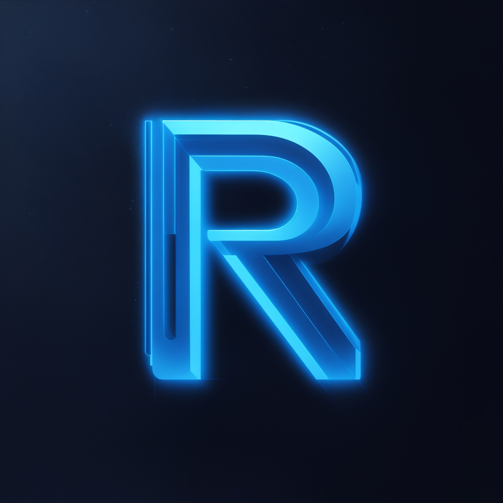

<div align="center" id="top"> 
  

[Convidar](https://discord.com/oauth2/authorize?client_id=1129229235811254362&scope=bot&permissions=8)

</div>

<h1 align="center">Resonance</h1>
<p align="center">
  

  

  

  

  

  

  
</p>

<hr>

<p align="center">
  <a href="#dart-sobre">Sobre</a> &#xa0; | &#xa0; 
  <a href="#sparkles-comandos">Comandos</a> &#xa0; | &#xa0;
  <a href="#rocket-tecnologias">Tecnologias</a> &#xa0; | &#xa0;
  <a href="#white_check_mark-pré-requisitos">Pré requisitos</a> &#xa0; | &#xa0;
  <a href="#checkered_flag-começando">Começando</a> &#xa0; | &#xa0;
  <a href="#memo-licença">Licença</a> &#xa0; | &#xa0;
  <a href="https://github.com/pedronicolasg" target="_blank">Autor</a>
</p>

<br>

## :dart: Sobre

Resonance é um bot feito usando como base no meu primeiro bot para Discord o [Nexcenture](https://github.com/pedronicolasg/Nexcenture) mas com grandes melhorias, melhorias essas que incluem utilizar o MongoDB como banco de dados invés do Quick.DB ou BetterSQLite3.

## :sparkles: Comandos

:heavy_check_mark: 3 comandos de debug;\
:heavy_check_mark: 9 comandos de economia;\
:heavy_check_mark: 2 comandos de diversão;\
:heavy_check_mark: 12 comandos de moderação/administração;\
:heavy_check_mark: 6 comandos de utilidade;

## :rocket: Tecnologias

As seguintes ferramentas foram usadas na construção do projeto:

- [Chalk](https://www.npmjs.com/package/chalk)
- [Discord.js](https://discord.js.org/)
- [Djs-template-gen](https://www.npmjs.com/package/djs-template-gen)
- [Discord HTML Transcripts](https://www.npmjs.com/package/discord-html-transcripts)
- [MongoDB](https://www.mongodb.com/)
- [Mongoose](https://mongoosejs.com/)
- [Node.js](https://nodejs.org/en/)
- [winston](https://www.npmjs.com/package/winston)

## :white_check_mark: Pré requisitos

Antes de começar :checkered_flag:, você precisa ter o [Git](https://git-scm.com), [MongoDB](https://www.mongodb.com/) e o [Node](https://nodejs.org/en/) instalados em sua maquina.

## :checkered_flag: Começando

```bash
# Clone este repositório
$ git clone https://github.com/pedronicolasg/Resonance

# Entre na pasta
$ cd resonance

# Instale as dependências
$ npm install
```

Depois disso é necessário criar dois arquivos de configuração pro bot, um na pasta ./src do projeto o `config.json`

```json
{
  "version": "", // Versão do seu bot
  "name": "", // Nome do bot
  "owner": "", // Seu ID
  "technologies": "" // Tecnologias usadas no bot
  "economy": {
    "coinname": "", // Nome da moeda do seu bot
    "coinsymb": "", // Símbolo da moeda do seu bot
    "coinicon": "" // Ícone da moeda do seu bot
  }
}
```

Em seguida é necessário criar um arquivo `.env` na pasta raiz do projeto para colocar as configurações secretas do bot

```env
TOKEN=Token do bot
NASAKEY=Sua chave da API da NASA para o comando /apod
MONGODB_URI=URI do MongoDB para conexão
```

Agora basta inicializar o bot usando o comando:

```bash
$ node .
```

## :memo: Licença

Este projeto está sob licença MIT. Veja o arquivo [LICENSE](LICENSE.md) para mais detalhes.

Feito por <a href="https://github.com/pedronicolasg" target="_blank">Pedro Nícolas</a>

&#xa0;

<a href="#top">Voltar para o topo</a>
